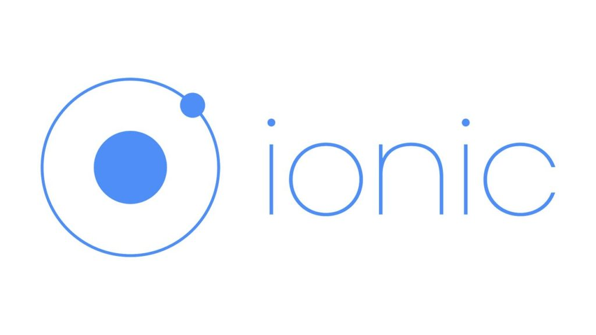

<!-- $size: 16:9 -->
<!-- footer: © Leif Wells 2017 -->
# Testing in Ionic: Configuring Existing Projects for Testing
## 
---
<!-- page_number: true -->
# Testing
Just shut up and do it!

---
# Two Kinds of Testing
- Unit Testing
- End-to-End Testing (E2E)

---
# What This Presentation Will Discuss
- Setting Up Testing Using Code from `ionic-unit-testing-example`
- Creating a Unit Test
- Creating an E2E Test

---
# What This Presentation Will Not Discuss
- How to Test _Your_ Code

---